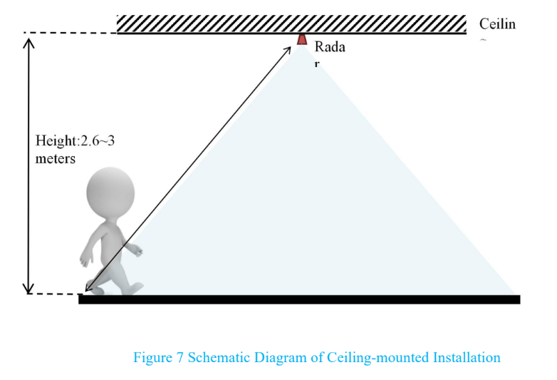
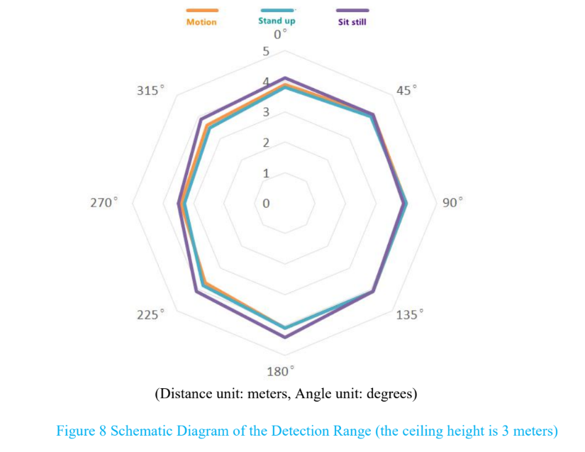
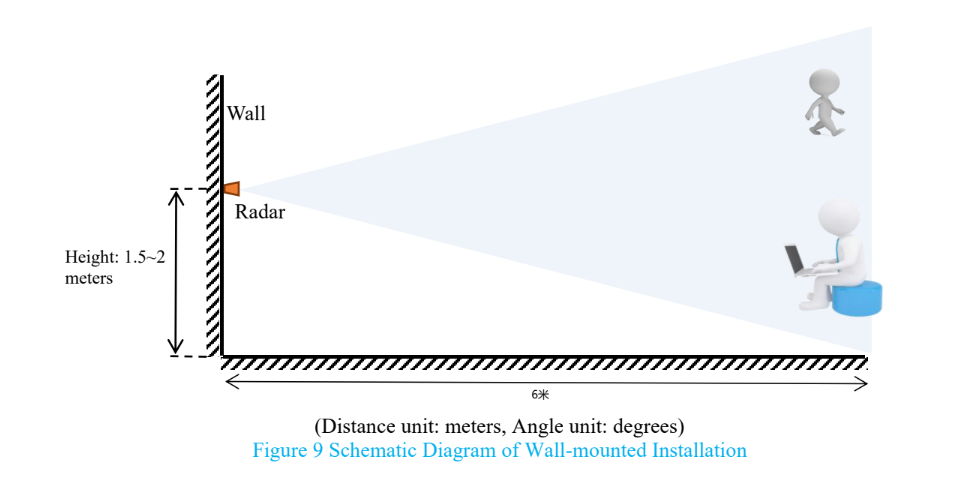
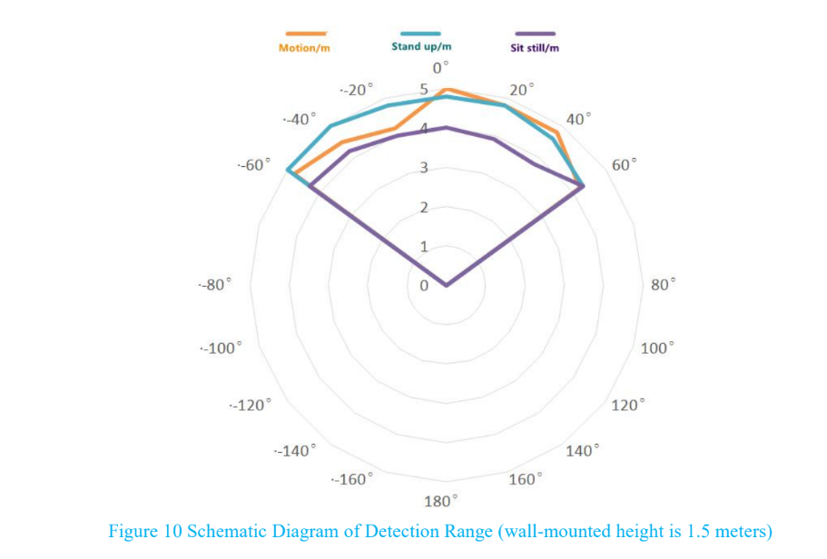

## Installation Questions
### Use Battery For Power
I bought one of these and it was as easy to set up as being mentioned here. The problem I have is that I have no power outlet in the toilet I am now planning to use it in, is it possible to power this thing with battery instead ? (by nlindblo@ha forum)
> I'm sorry, but I'm afraid that batteries are not a viable option considering the relatively large amount of power required by the device. The radar module is a sensor that generates a lot of heat and consumes a lot of power, and the usual operating current is up to 70ma, while the esp32 in the RF section is also very power hungry.  

### Working angle, Distance of Radar

What is the working angle of the radar, what is the distance?  

From the [documentation](https://drive.google.com/drive/folders/16zI-fium_BZeP08EyQke0rWp0BJTMvw3) of the radar module there is some information about the parameters:
- The longest sensing distance is up to 5 meters  
- Large detection angle, coverage up to ±60 degrees

