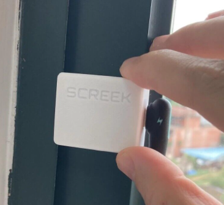
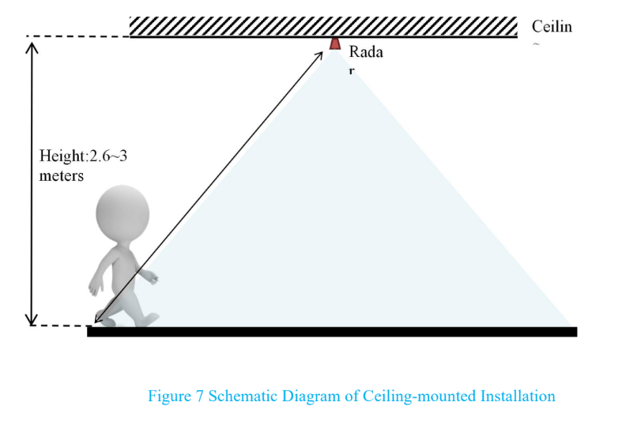
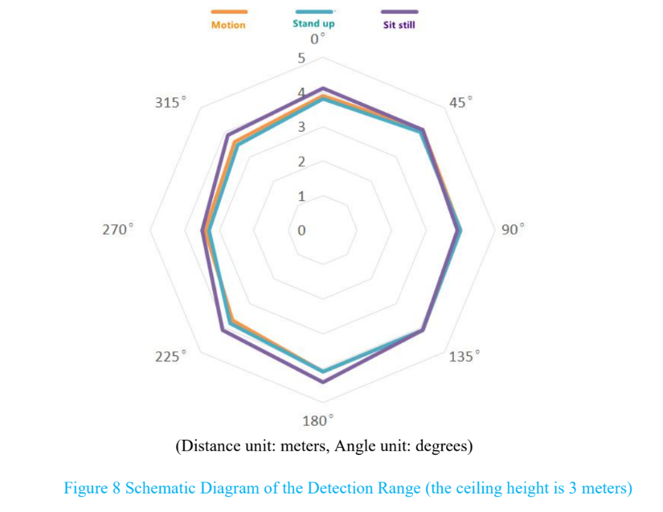
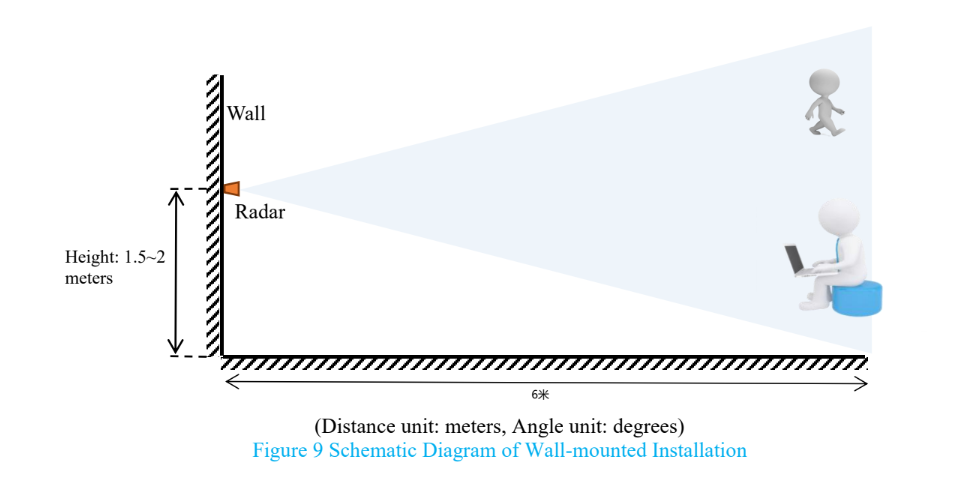
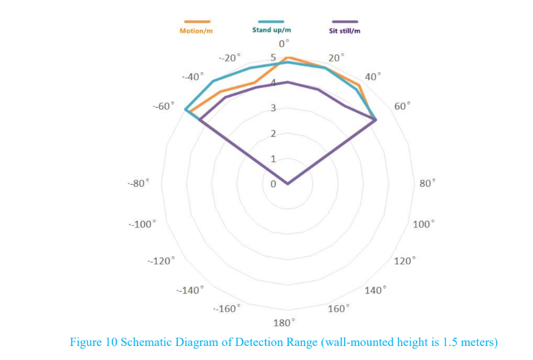

## Mounting direction of the sensor
is there a front and a back to the sensor, I assume it has to be pointed a certain way with the letters on the outside.(Harry Fine)
> If mounting on the wall, please do this to turn the LOGO side up to keep the sensor at the best working angle.

!!! note
	If you want to know more about radiation angle, and distance, please refer to: [more Info about ld2410](installation_faq.md#working-angle-distance-of-radar)

<figure markdown>
  
  <figcaption>Radar installation direction</figcaption>
</figure>

## Use Battery For Power
I bought one of these and it was as easy to set up as being mentioned here. The problem I have is that I have no power outlet in the toilet I am now planning to use it in, is it possible to power this thing with battery instead ? (by nlindblo@ha forum)
> I'm sorry, but I'm afraid that batteries are not a viable option considering the relatively large amount of power required by the device. The radar module is a sensor that generates a lot of heat and consumes a lot of power, and the usual operating current is up to 70ma, while the esp32 in the RF section is also very power hungry.  

## Working angle, Distance of Radar

What is the working angle of the radar, what is the distance?  

From the [documentation](https://drive.google.com/drive/folders/16zI-fium_BZeP08EyQke0rWp0BJTMvw3) of the radar module there is some information about the parameters:
- The longest sensing distance is up to 5 meters  
- Large detection angle, coverage up to ±60 degrees

