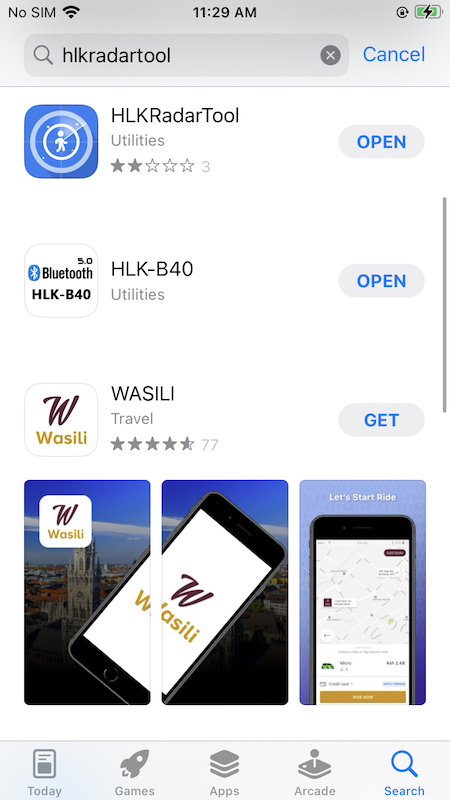
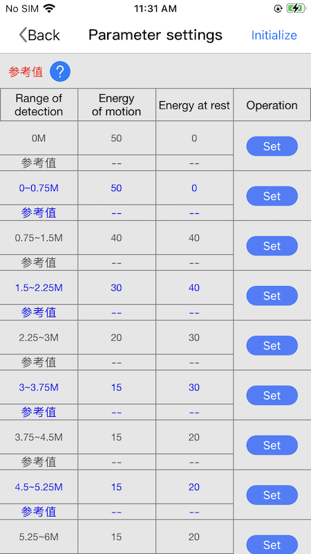
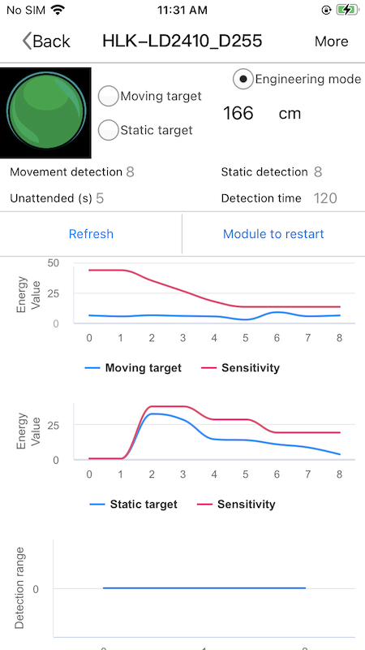

## HLKRadarTool APP

### How can i get the HLKRadarTool app?
- If you are using IOS platform, just search "HLKRadarTool" in APP Store and install it.
<figure markdown>
  
  <figcaption>Search HLKRadarTool in App Store </figcaption>
</figure>

- If you are using an installed phone, it doesn't seem to be searchable in the Play Store, but Hilink provides a page to install the program: [HLKRadarTool For Android device](https://www.pgyer.com/Lq8p)

### What is the purpose of the hlk app?   
- It provides dynamic feedback on the working condition of the radar, as well as parameter adjustment, which makes it easy to adjust the working distance of the radar and the sensitivity of each distance gate in order to make the radar's better for you.  

<figure markdown>
  
  <figcaption>This page makes it easy to see the relationship between the current energy detected by the radar and the sensitivity set.</figcaption>

  
  <figcaption>Set the parameters of the radar in this page and let it come to work more in line with your requirements.</figcaption>
</figure>

