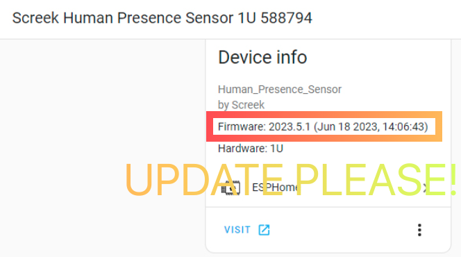
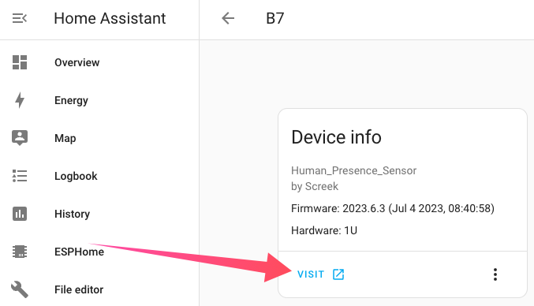
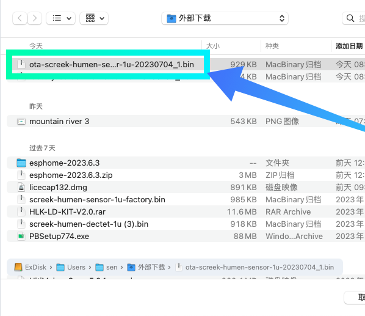
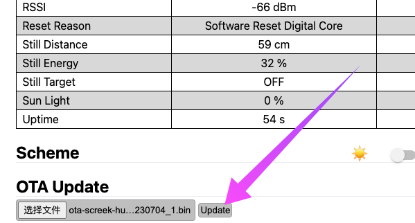

OTA (On The Air) firmware is one of the most convenient methods of updating:  

- Update via WIFI without removing the sensor.  
- Operates on either PC or MAC, even on cell phones. Only a modern browser is needed (Chrome, Safari, FireFox, Edge.)

!!! tips
	To identify the version of your current firmware, please visit our [version identification](version.md) page.

!!! tips
	If your firmware is earlier than 2023.0704, then there may be some stability issues.   
	Please try to update your firmware to this date(V2023_0704_1) or later.  

!!! waring
	If your firmware is use [Jun 18 2023] version, please update it soon as possible.  
	We have received some feedback that this version may cause bad dropouts.

<figure markdown>
  
  <figcaption>If you are using the June 2023 firmware, it is recommended that you update immediately.</figcaption>
</figure>

## Firmware File
### V2023_0704_1
We have made a number of improvements to the stability of 1U:  

- Reduced the update strategy for some debug parameters  
- Lowered the main frequency, reducing 240Mhz to 80Mhz, which our tests found to be fast enough for a task like radar. This is even better for temperature and persistence stability.  
- Improved the Wifi signal strategy, removing the overly aggressive one.    

**Downloads**  

[Download V2023_0704_1](../files/ota-screek-humen-sensor-1u-20230704_1.bin){ .md-button .md-button--primary }

!!! tips
	If your firmware version is the same as the one shown in the picture, then that's the version you've got: 

<figure markdown>
  
  <figcaption>Firmware version identification 2023_0704_01</figcaption>
</figure>

!!! tips

	If you are experiencing problems with your download, you can try [Download From Dropbox](https://www.dropbox.com/s/1nqeoqzv4vf8x1e/ota-screek-humen-sensor-1u-20230704_1.bin?dl=0)

## How To Use

-  First we need to find the corresponding radar devices in HomeAssistant, they are often in Esphome, please note that we have modified its default name here. Click on the **VISIT** button, this will take you to the sensor's own web server interface.

<figure markdown>
  
  <figcaption>Go to Devices and Services page.</figcaption>
  
  
  <figcaption>Click 1 Device</figcaption>
  
  
  <figcaption>On the device page, click the VISIT button.</figcaption>
</figure>

- In the sensor's web server interface, which looks like this, select the **BROWSE** button to find the .bin file you downloaded earlier:

<figure markdown>
  
  <figcaption>Click Broswer Button.</figcaption>
  
  
  <figcaption>Find the bin file.</figcaption>
  
</figure>

- Click on the **update** button and wait for a while, depending on the network, it can be anywhere from a few seconds to tens of seconds.  

<figure markdown>
  
  <figcaption>Click The Update Button.</figcaption>
  
  
  <figcaption>Wait The Update Sucusee Info.</figcaption>
</figure>

!!! notes
	Due to some design issues with esphome, sometimes showing success doesn't mean the firmware is updated. Finally, the version date shown on the device page in Home Assistant is used as a reference.

-  Return to HA's device page, refresh the page, and observe if the version information changes, and if it becomes the new date, then the update is complete.

<figure markdown>
  
  <figcaption>Refresh the page and check the firmware version.</figcaption>
</figure>

## Credits
- Thanks to *Harry Fine* for giving us advice on making language a magic.