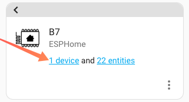

Finding out the version of your current sensor can help you determine your firmware version. For some software-induced problems, this will be helpful.    

Here is a step by step way for you to find out how to identify the device version in Home Assistant.  
<figure markdown>
  
  <figcaption>Go to Devices and Services page.</figcaption>
  
  
  <figcaption>Click 1 Device</figcaption>
  
  
  <figcaption>The firmware version is followed by the Firmware on the page.</figcaption>
</figure>

!!! info
	Once you have determined your version, you can check our [OTA](ota.md) update page for new firmware and decide if you need to update it.  