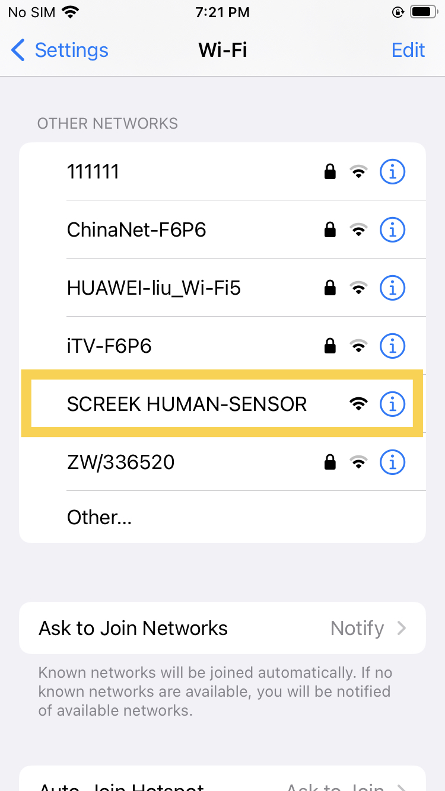
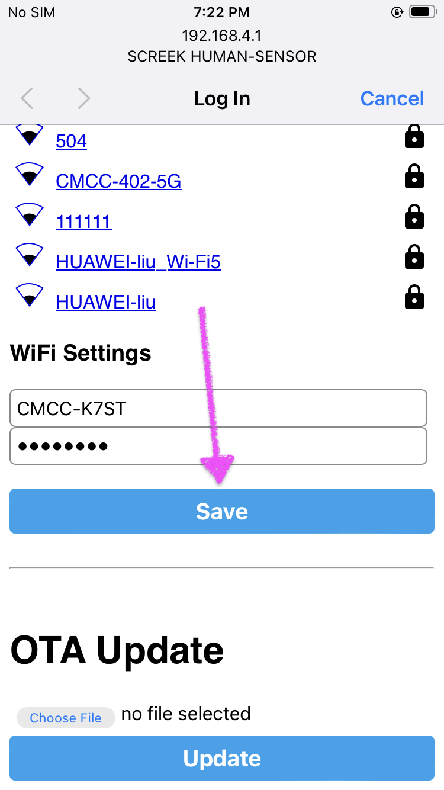
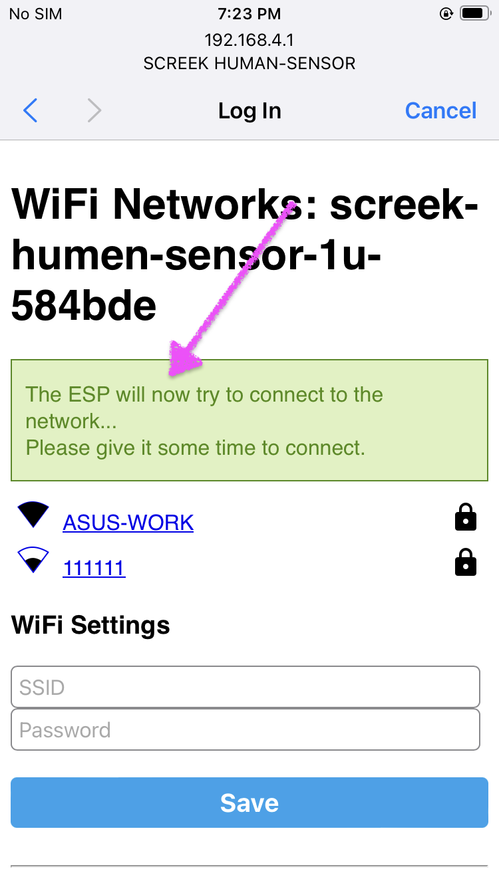
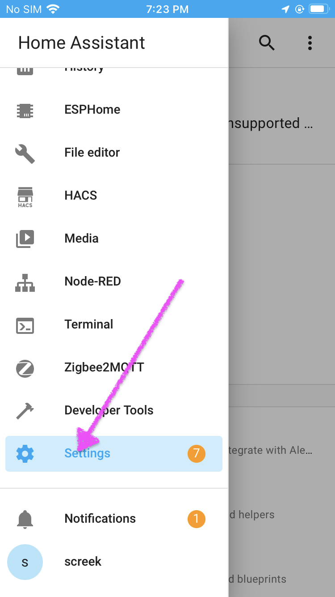
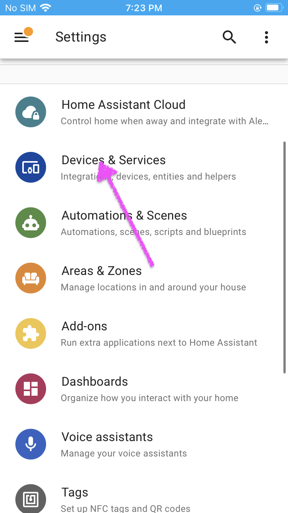
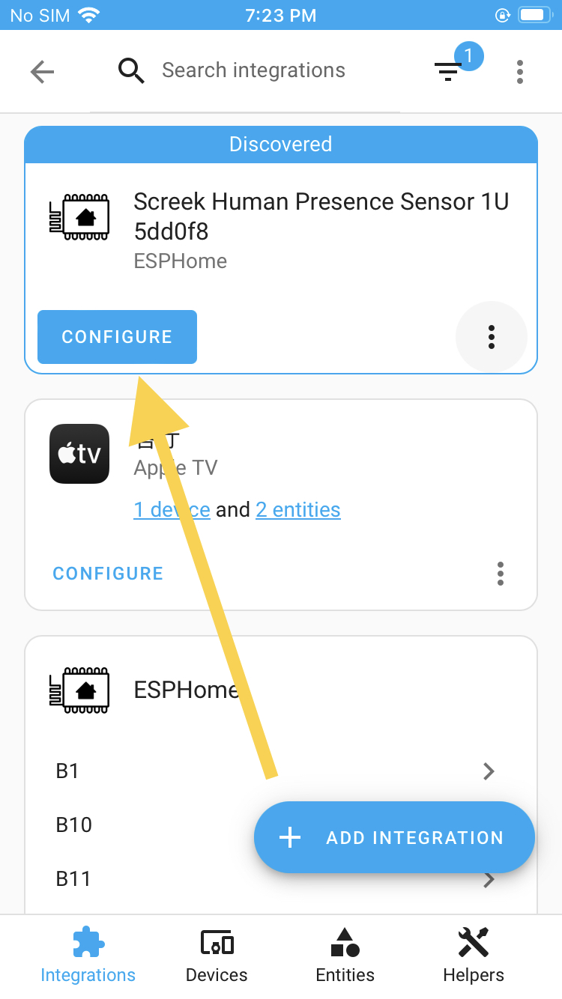
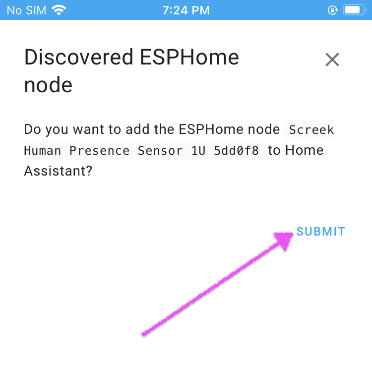
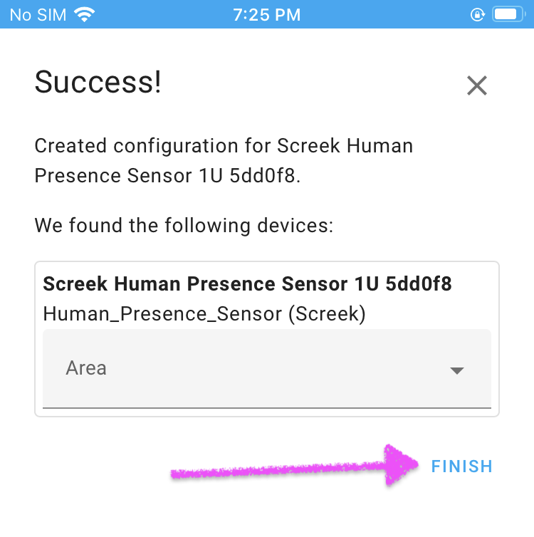
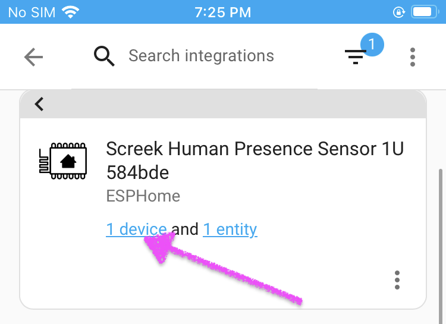

## Configuring By A Phone

!!! tips
	After connecting the sensor's hotspot, the phone will pop up a Configure Network page,   
	if it does not pop up automatically, please enter the page manually: [http://192.168.4.1](http://192.168.4.1).

<figure markdown>

<figcaption>On the Select Hotspot page of the phone, select the hotspot for the sensor.</figcaption>

<figcaption>After connecting the sensor's hotspot, the phone will pop up a Configure Network page, if it does not pop up automatically, please enter the page manually (http://192.168.4.1).Select a network hotspot for the sensor and enter the password.Click Save Button.</figcaption>

<figcaption>The device will start networking and if it goes well, the phone will disconnect from this temporary hotspot and go back to the original hotspot.</figcaption>

<figcaption>Click on Settings in the sidebar of HA</figcaption>

<figcaption>Go in Device & Services</figcaption>

<figcaption>HomeAssistant will automatically discover your sensor and click Configure.</figcaption>

<figcaption>Click SUBMIT.</figcaption>

<figcaption>Click FINISH.</figcaption>

<figcaption>All Done! After the device is connected, you can find the device in the ESPHome integration and click 1 device to view the device properties.</figcaption>

</figure>