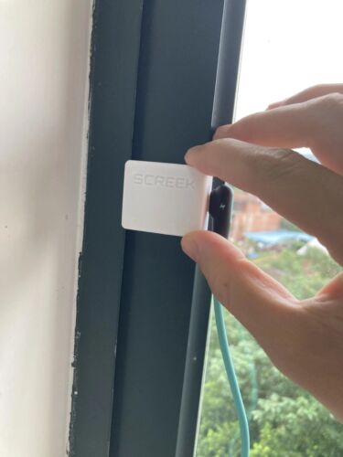

Thank to use **Screek Human Presence Sensor 1U**, here we want to help you to connect the sensor to Home Assistant quickly.

In case you're confused about our models, this is what 1U looks like.   
It is a small square box.  
We made a lot 1u radars and it is a DIY product we are very proud of.  

<figure markdown>

  
  <figcaption>Identify your sensor model, 1u is a small square box.</figcaption>

</figure>

A number of optimizations have been made to ensure that the entire connection is completed as quickly as possible.

If you are not familiar with EspHome devices, then you can refer to our Quick Start Guide:

[Getting Start](getting-start.md){.md-button .md-button--primary}

## Acknowledgments
- The developers of Home Assistant, ESPHome, who have built world-class open source projects.   
- The esphome library for the ld2410, made by regevbr, has made the popularization of the ld2410 possible.  
- Our users gave very valuable suggestions, as well as friends from the reddit community, and enthusiasts from the HomeAssistant forums, and the HomeAssistant Facebook group.