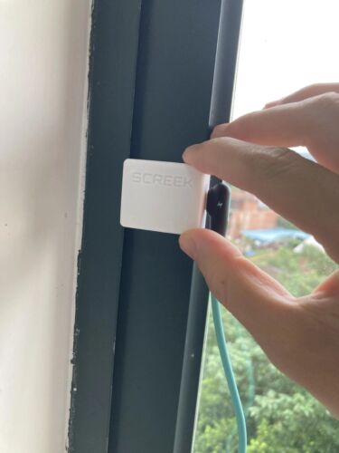

Thank to use our human presence sensor, here we want to help you to connect the sensor to Home Assistant quickly.

In case you're confused about our models, this is what 1U looks like.   
It is a small square box.  
We made more than 1000 radars and it is a DIY product we are very proud of.  

<figure markdown>

  
  <figcaption>Identify your sensor model, 1u is a small square box.</figcaption>

</figure>

## Configuring the network

**To be completed**