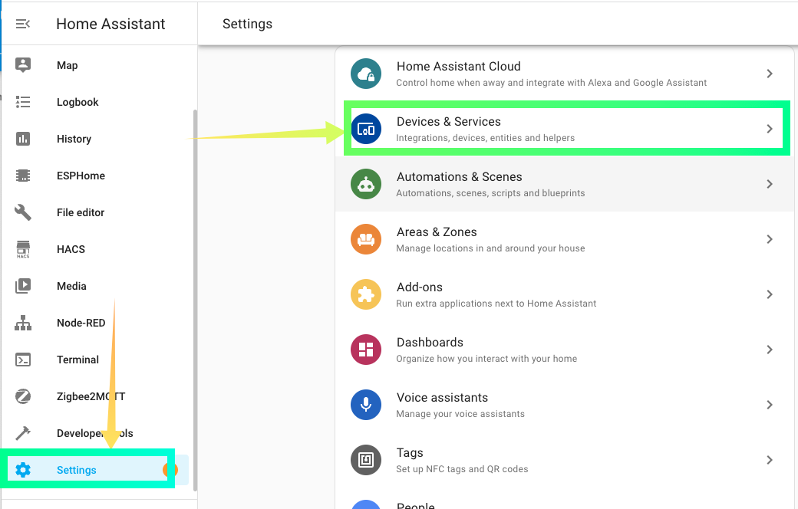

If you encounter some situations where you can't simply connect directly, here will be some suggestions.

## Cannot discover devices in Home Assistant

In most cases, as soon as the network is configured, the sensor broadcasts its own address and Home Assistant is able to discover the device automatically.    
  
However, some circumstances may affect this discovery process:    
- If the router blocks the devices from accessing each other, the devices are undiscoverable and cannot be connected. For example, the sensor is connected to an isolated guest network.  
- If a sensor has been added in Home Assistant, but then removed, it will not be discovered again at this point. This behavior is already present in Home Assistant version 2023.06.  
  
### Network configuration using USB cable
In order to configure the sensor directly with the USB cable, you need a Mac or or Windows, a Chrome browser, or an Edge browser.  
Connect the sensor to your computer with a Type-C cable and visit the configuration page at  
> [https://web.esphome.io/](https://web.esphome.io/){.md-button .md-button--primary}

<figure markdown>
  
  <figcaption>Click Connect Button</figcaption>
  
  
  <figcaption>Select Loin S2-Mini Port</figcaption>

 
 <figcaption>Select Configure Wi-Fi Button</figcaption>

 
 <figcaption>Click CONNECt TO WI-FI</figcaption>

 
 <figcaption>Select the name of your wireless network and if it does not appear, click the refresh button with the arrow in the upper right corner.</figcaption>

 
 <figcaption>Enter the password to connect to the hotspot and click Connect</figcaption>

 
 <figcaption>Wait a little while for it to finish mapping the network. Sometimes it won't work once, try twice more.</figcaption>

 
 <figcaption>If successful you will see this page, click VISIT DEVICE and you will see the IP page where the device is located.</figcaption>

 
 <figcaption>This page is the actual IP address of the device, and the presence of this page indicates that the sensor is working well.</figcaption>
 
</figure>

!!! tips

	You can keep this page, or write down the IP address of the device. This IP address is very xyz'y for the upcoming manual setup of the sensor in Home Assistant

### Adding devices manually in Home Assistant

<figure markdown>
  
  <figcaption>Go to Devices and Services page.</figcaption>

  
  <figcaption>Click the ADD INTEGRATION button in the lower right corner.</figcaption>

  
  <figcaption>Type esp in the pop-up dialog box and find ESPHome integration.</figcaption>

</figure>
!!! notes
	You don't need to install ESPHome addon, esphome integration comes with HomeAssistant. esphome addon is for development.

<figure markdown>

  
  <figcaption>Select: Setup another instance of ESPHome.</figcaption>

 
 <figcaption>Copy the IP address of the Sensor Device page to the Host input box of ESPHome. Then Click SUBMIT.</figcaption>
 
</figure>

!!! warning 

	Please do not include the http:// prefix characters, only the ip address.  
	For example instead of entering http://10.0.0.142/, enter 10.0.0.142.

<figure markdown>
 
  
  <figcaption>If everything goes well, you will see this dialog. Click FINISH to finish adding.</figcaption>
  
</figure>
#### If Connection failure
If you are alerted to a dialog box that you cannot connect to ESP, then it means that the network communication between HomeAssistant and the sensor device is having trouble. Here are some troubleshooting suggestions.

<figure markdown>

  
  <figcaption>Unable to access sensor dialog</figcaption>
  
</figure>

Some of these suggestions:    
- This may mean that your Home Assistant and the sensor are not on the same LAN, or they are not accessible to each other. Please check your router settings to make sure they are on the same LAN.  
- It could be that the IP address was entered incorrectly because it was entered manually.