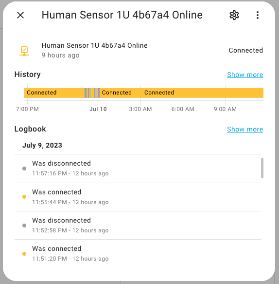
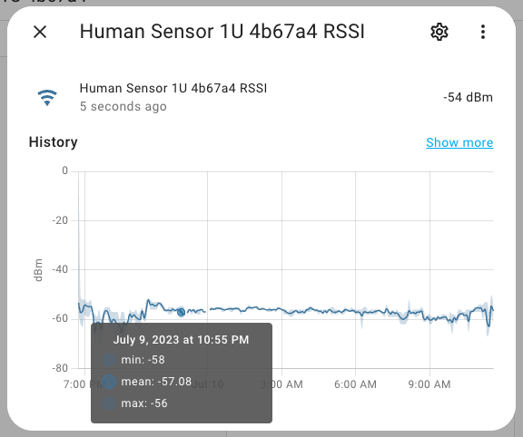
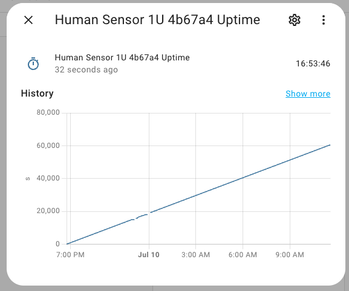
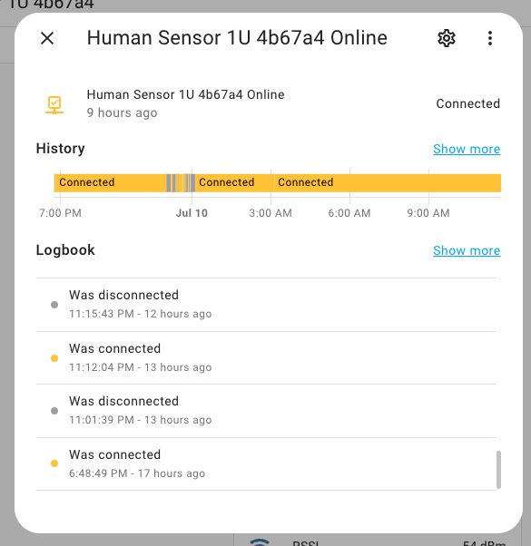
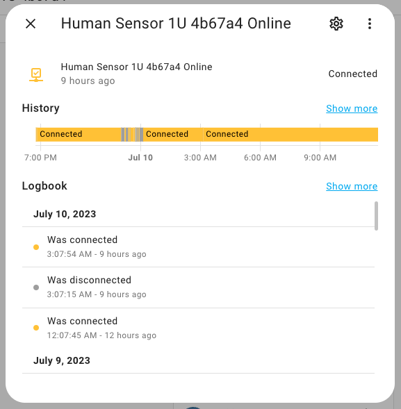

## Situation
If your sensor regularly loses response, drops out of wifi and then comes back in, this may be due to poor network connection status or excessive channel interference.  

## Diagnosis
If we look at the online properties of the device, we may see results such as  

<figure markdown>
  
  <figcaption>Online state of sensor</figcaption>
</figure>
  
  
And if we look at the RSSI, we may find that the signal is not too bad  
  
  
And the uptime of the device is okay, no dropouts  
  

The reasons for such a situation could be various:    
- The 2.4g wifi channel is full of interference, even if the RSSI looks excellent, it is still possible that the channel is full of various signals and these interferences can lead to a decrease in real time.  
- The router is overloaded with a large number of connected wireless devices, resulting in reduced responsiveness.    

## Recommendation
Suggestions for troubleshooting then are:  
- Try rebooting the router. In fact, it is good to set your wireless router to automatically reboot every morning if possible. After another reboot, in addition to freeing up the router's own memory, it will restart the wireless network startup plan, which will scan the surrounding channels and automatically select an idle channel if you use the default setting of automatic channels.  

### A DEMO
For example, in this case, the device was connected at 6:48pm, and it was stable until 11pm, but at 23pm, it was a bit intermittent, and then the surrounding channels became noisy.  
  
But after the router's automatic reboot at 3:07, it was almost always smooth by the next day.    
  
  
