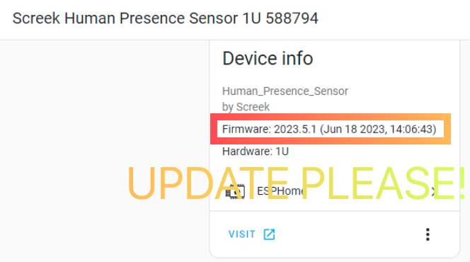

<figure markdown>
  
  <figcaption>A device information page that appears to be unavailable</figcaption>
</figure>

We are sorry that this is a very serious problem that affects the experience, and if this happens to you, here are some of our exclusion suggestions:  

- Check your firmware version, if your firmware version is lower than V2023_0704, please try to update the firmware immediately. The new firmware has improved operational stability.
- Check the signal distance between the sensor and the router, if the signal is too far and too poor, it can cause a loss of connection. On the page of device information there is an RSSI to check, it is a negative value, the larger the value the better. For example, -24 dB is a very good signal, -70 dB is very bad.
- Check the load capacity of the router. The device uses 2.4G to communicate with the wireless router, and although it is fully optimized, an overloaded wireless router may cause a lost connection. If possible, setting your wireless router to reboot regularly at an interval will help. In our own case, we automatically reboot our router once a day at 3am.
- Make sure the device is in a relatively well ventilated area, radar work generates a certain temperature and if there is no ventilation, it may cause a build up. There is a temperature to check in the device information page.

!!! waring
	If your firmware is use [Jun 18 2023] version, please update it soon as possible.  
	We have received some feedback that this version may cause bad dropouts.

<figure markdown>
  
  <figcaption>If you are using the June 2023 firmware, it is recommended that you update immediately.</figcaption>
</figure>
