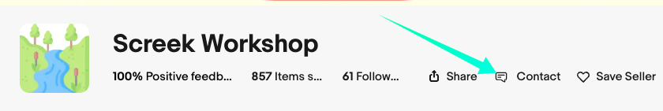

You can of course also contact us on our [Facebook Pages](#facebook-pages) or communicate with us in our [Facebook Group](#facebook-group).

## Community
### Facebook Group

We have formed some user exchange communities so that you can talk freely about your ideas in them.  
 
> [:material-facebook: facebook.com/groups/screekworkshop](https://www.facebook.com/groups/screekworkshop){ .md-button .md-button--primary}

### Facebook Pages
We also provide a Facebook Pages to announce some of our new products, or to announce some events.  

> [:material-facebook: facebook.com/screekofficial](https://www.facebook.com/screekofficial){ .md-button .md-button--primary}

## Message

### eBay Message

We recommend this method, it allows us to quickly understand the DIY products you have purchased and get your order information.  
We have experienced many times that our email replies have been placed in the wrong spam folder, making it impossible for us to respond in a timely manner.  

- You can also contact the US through your **Purchase history** by selecting **Contact seller** next to the item.

- And you maybe can contact us at our store page: On the home page of our eBay store, you can find a Contact button, click on it and you can get in touch with us.
> [https://www.ebay.com/str/screekworkshop](https://www.ebay.com/str/screekworkshop){.md-button .md-button--primary}
> 
<figure markdown>
  
  <figcaption>Contact Button On eBay Store</figcaption>
</figure>

!!! tips

	The official eBay help file about contact seller:  [Contacting a seller](https://www.ebay.com/help/buying/resolving-issues-sellers/contacting-seller?id=4021)

## Facebook Message

On our public FB homepage, you can choose to send us a message directly. Due to the time difference, we won't be able to get back to you in time, but we'll get to you as soon as we can!

> [:material-facebook: facebook.com/screekofficial](https://www.facebook.com/screekofficial){ .md-button .md-button--primary}

### Mail Support
If you encounter any problems, you can send us an email.    

[:octicons-mail-24: Mail US](mailto:screekworkshop@gmail.com){.md-button .md-button--primary}

???+ Note
    We will reply to your emails promptly due to stranger emails, but they may go to **spam** in your mailbox, so please check the spam inbox.    
