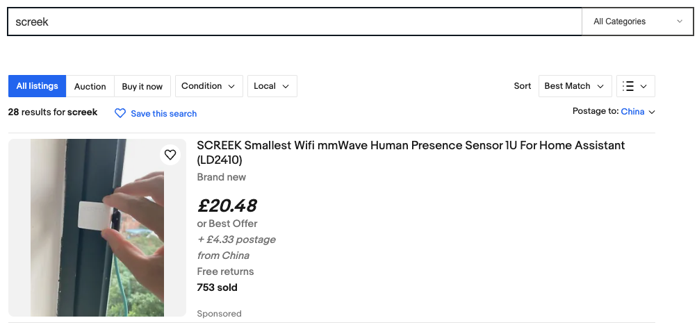

Welcome to the Screek Workshop.

Here are some of the little electronics we make, we are often asked how to use them, and how to get started quickly.    

Although we do a lot of software optimization, it seems that a document is always more helpful.    

So, we've put together some common questions here along with some getting started guides.    

## eBay Store
### U.S. Sites
For those of you who want to get our products, here is our eBay store:    

[https://www.ebay.com/str/screekworkshop](https://www.ebay.com/str/screekworkshop){.md-button .md-button--primary}

### Other Country eBay sites
We support shipping to all over the world, if you use another site on eBay, you can search **SCREEK** to find our products.

For example, on the eBay UK site (https://www.ebay.co.uk), you can search for SCREEK and find our human presence sensors.
<figure markdown>
  
  <figcaption>Search Screek in Non-U.S. eBay Site</figcaption>
</figure>

## Support

If you encounter any problems, you can send us an email.    

[:octicons-mail-24: Mail US](mailto:screek_workshop@icloud.com){.md-button .md-button--primary}

???+ Note
    We will reply to your emails promptly due to stranger emails, but they may go to **spam** in your mailbox, so please check the spam inbox.    

You can of course also contact us on our [Facebook Pages](#facebook-pages) or communicate with us in our [Facebook Group](#facebook-group).

### Facebook Group
- We have formed some user exchange communities so that you can talk freely about your ideas in them.  
 
> [:material-facebook: facebook.com/groups/screekworkshop](https://www.facebook.com/groups/screekworkshop){ .md-button .md-button--primary}

### Facebook Pages
- We also provide a Facebook Pages to announce some of our new products, or to announce some events.  

> [:material-facebook: facebook.com/screekofficial](https://www.facebook.com/screekofficial){ .md-button .md-button--primary}

