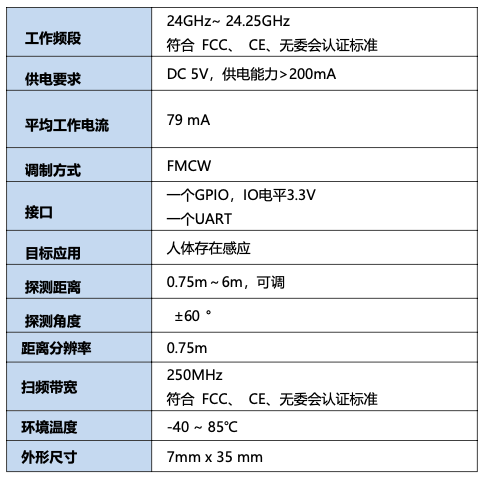

这是一款专门为HomeAssistant定制的人体24G雷达传感器，基于ESPHome固件定制，使用WIFI连接，采用通用的TYPE-C USB供电。  

!!! info "购买"
	如果你还没有产品，不妨选购一件！一起探索，一起交流，一起创造！  
	
	[选购:simple-shopee:](howtobuy.md){.md-button}

## HA界面

设备接入后，HomeAssistant中的控制界面如下：

!!! info "固件版本"
	信息和固件版本有关系，如果你的界面和这里显示的不一样，请核对固件的版本时间。

## 新功能
### 光感功能

!!! note "全新推出"
	新固件提供光感获取，采集雷达前面板的光线值！值范围是0到255。

## 产品特色

- WIFI直连，不需要任何网关。
- 使用ESP32-C3作为通信芯片，射频能力优秀，发热量低。
- ESPHome直接接入，只要完成配网之后，就直接可以在HomeAssistant中搜索设备。
- 1S版带有显示屏，能够直观的显示雷达工作状态，了解运行情况。

!!! info "版本区别"
    1W版除了没有显示屏之外，功能和1S是一样的。  

### 高级特色
- Type-C口除了作为供电，也能作为配网和恢复固件用。
- 能够插入电脑使用网页版的[ESPHome Web Tools](https://web.esphome.io/)来查看运行日志。

## 产品参数

### 雷达性能
