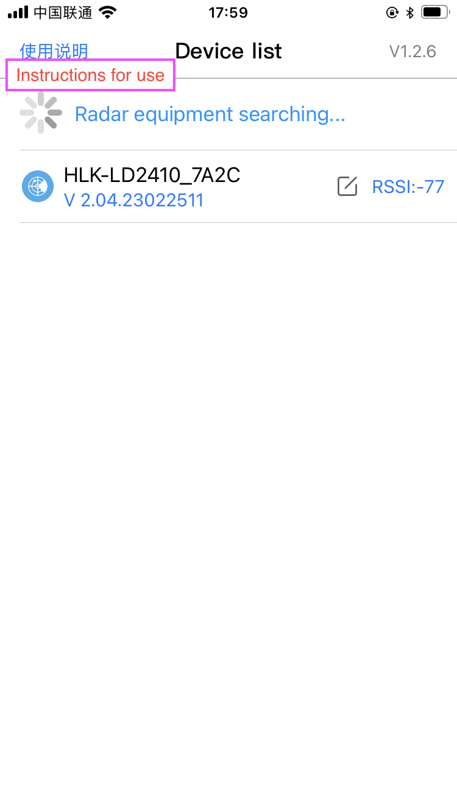
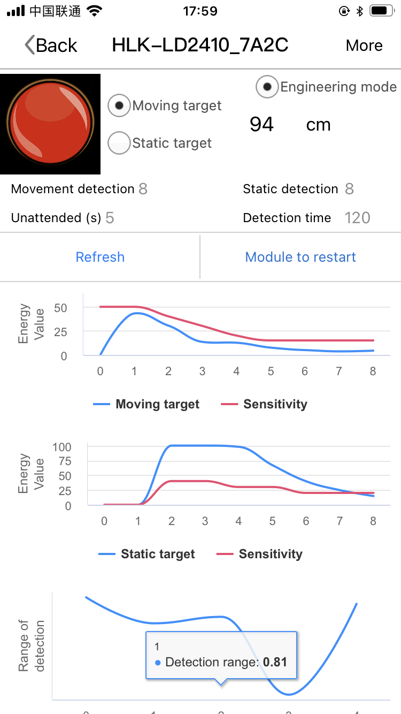
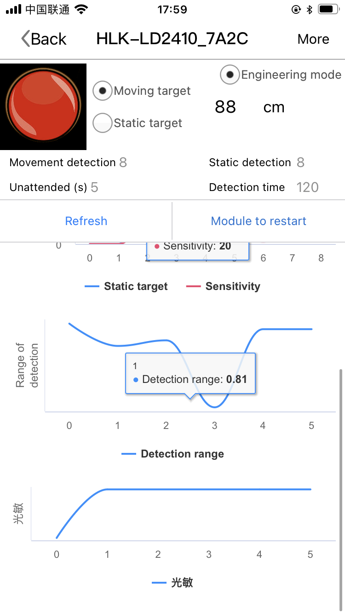
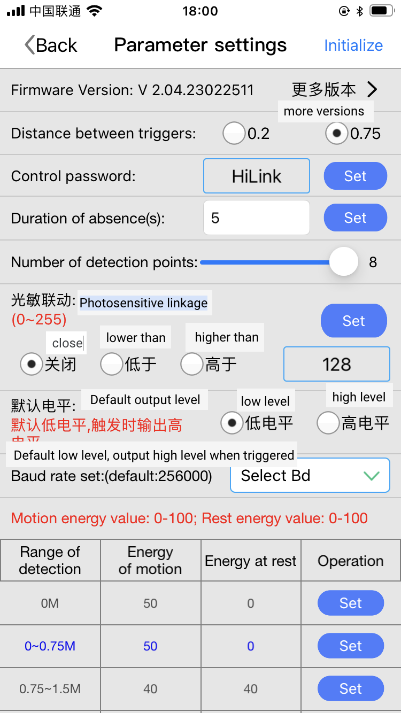
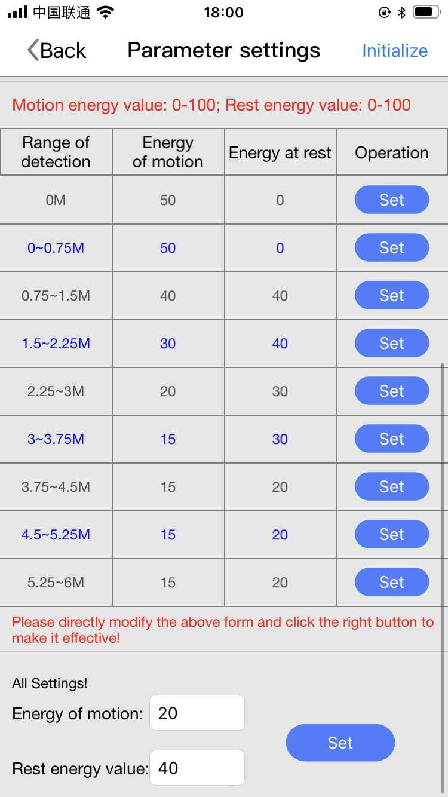
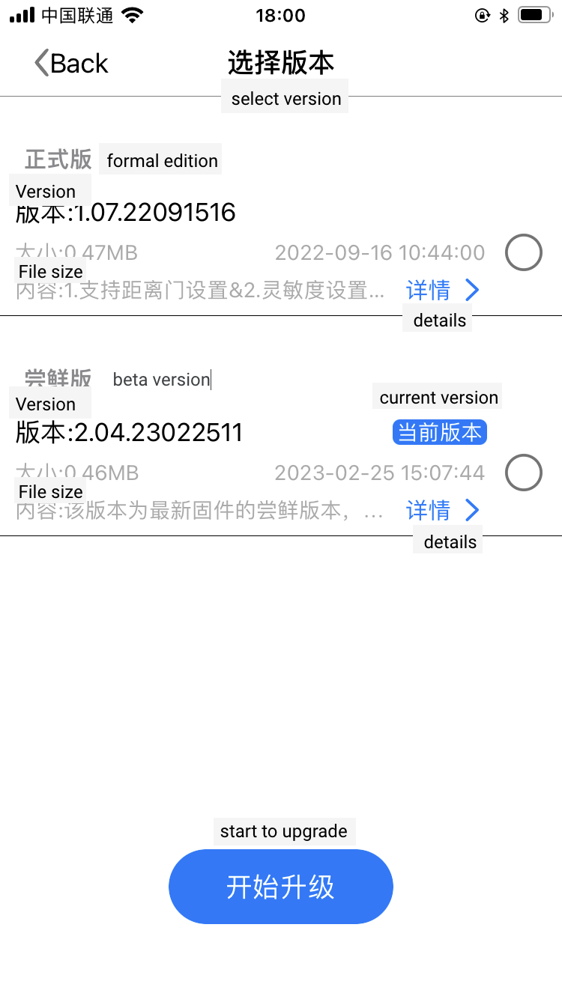

## English Translation
Hilink's official HLKRadarTool APP can easily set and adjust the parameters of ld2410b(c) series*. There is a latest beta firmware (v2.0.x) that can read the photoresistor on the radar and perform rough photosensitive linkage settings. For our own modified firmware, we directly read this parameter value.

Notice
* ld2410 because there is no bluetooth function

