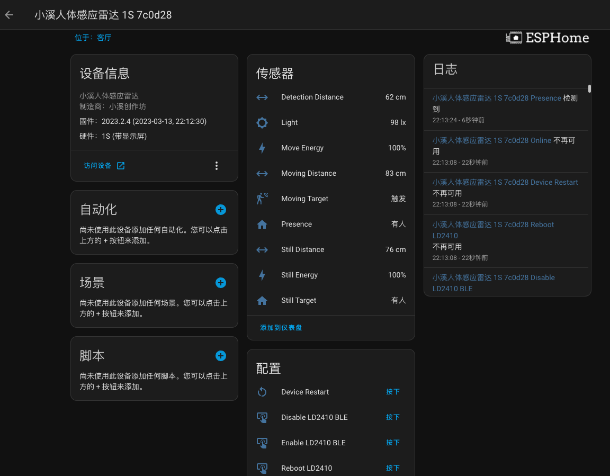
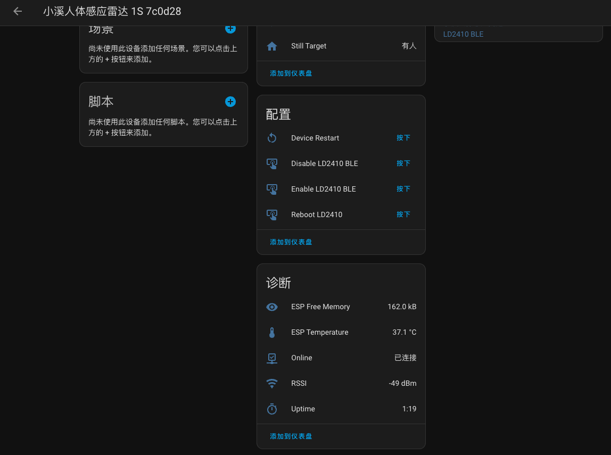

这是一款专门为HomeAssistant服务的人体24Ghz雷达探测器，能够探测移动的人体，也能探测静止中的人体。基于HiLink的LD2410B(C)雷达模块，模块本身具有蓝牙功能，能够使用HiLink的HLKRadarTool来非常方便的调节参数，这个模块很有名，因为它出色的性价比，还有相当丰富的参数调节，能够让人体探测器更加智能许多。

通过结合ESP32-C3还要聪明的LD2410B

## 特色
- 我们使用调校很优秀的ESP32-C3模块，优秀的RF调校使得信号能够保持在一个很不错的范围，让它时时刻刻能够捕获到最及时的信息。
- 在默认的固件里，你的操作非常简单，我们取消了AP配网密码，也简化了HomeAssistant的连接过程里的索要API密钥，使得可以如此迅速在HomeAssistant里发现新设备，快速添加它，非常的方便。
- 这是LD2410B的一项新固件功能，大概在2023年2月发布的固件版本里提供，我们通过使用工程模式来获取到雷达输出的光线传感器值，能够粗略的反应日光的变化。如果你希望有光线的数据，它可能可以给你带来一些帮助。

...

## 参数
直径和高度：59mm~61mmx12mm

雷达特性：

## HomeAssistant界面

设备接入后，HomeAssistant中的控制界面如下：

!!! info "固件版本"
	信息和固件版本有关系，如果你的界面和这里显示的不一样，请核对固件的版本时间。

