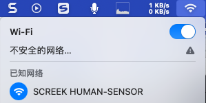
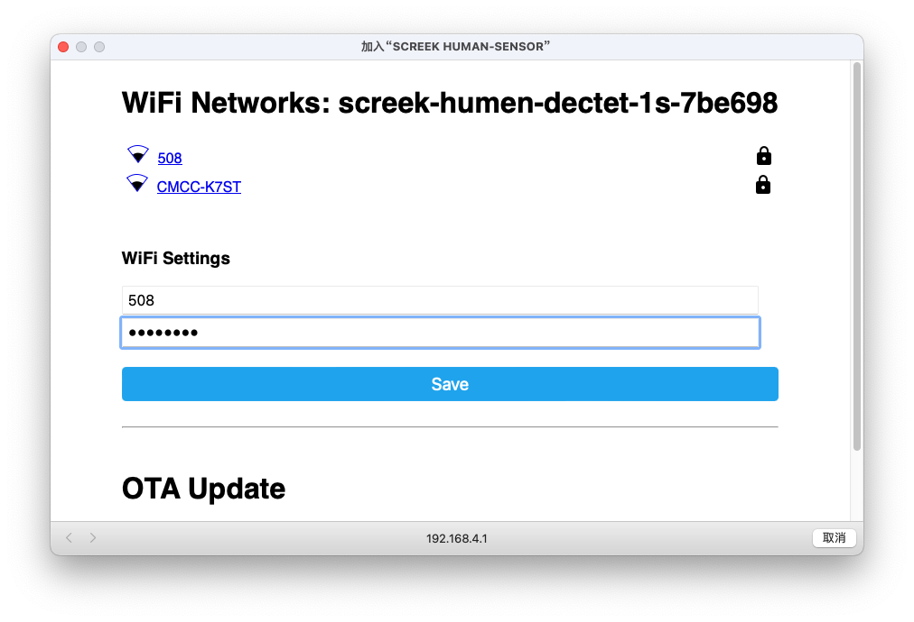
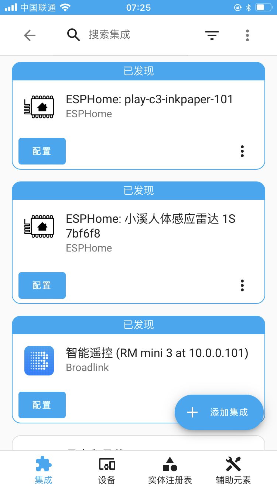
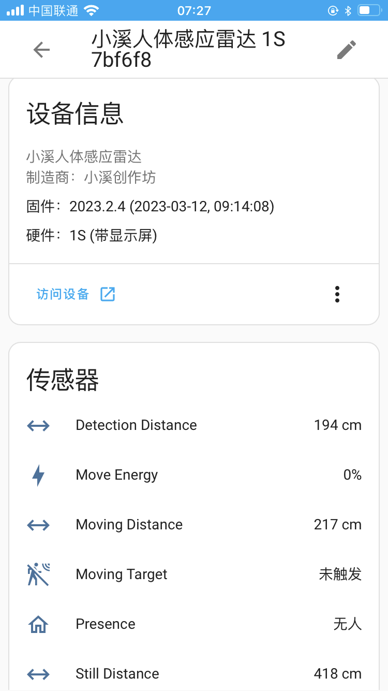

拿到了雷达之后就需要开始安装了，安装所需调条件：

- USB电源适配器：5V，1A。
- TYPE-C 电源线
- homeassistant服务器：不限于docker版，单独安装版，homeassistant os版。

## 连接电缆
将一根type-c线的公头插入雷达，另一头插入USB电源适配器。此时，就完成了雷达的硬件安装。  

雷达的显示屏此时应该能够点亮。 

## 配网

我们提供了多种配网方式，方便灵活设置。其中包括：

1. AP配网：连接配网热点，进入设置页面选择网络。

如果没有配网，会有一个热点以`SCREEK HUMAN-SENSOR`开头。  

2. USB口配网：插入一台电脑，打开一个Chrome浏览器，进入网页连接USB口来选择网络。  

### 连接HA

正确配网后，在HA的设备集成里就能发现雷达设备，点击添加即可：

